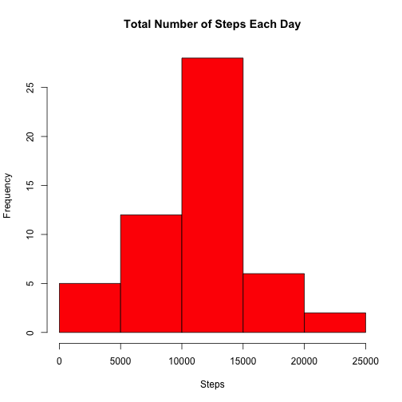
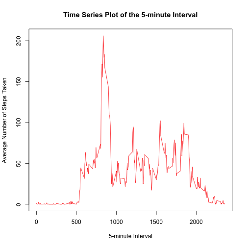
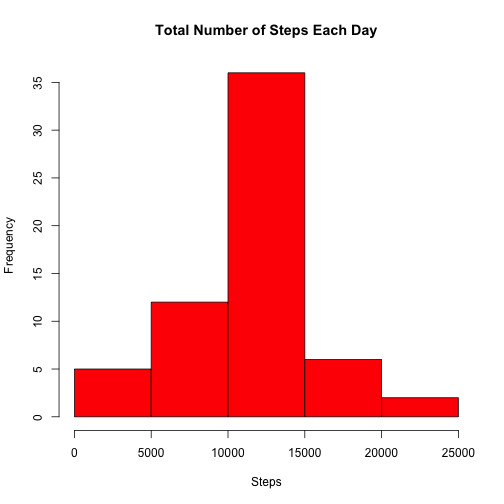
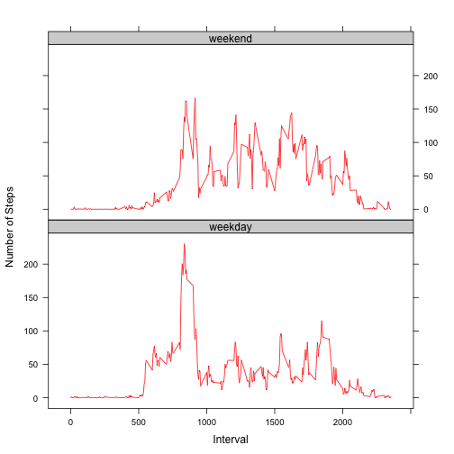

Reproducible Research: Peer Assessment 1  

Jay Urbain, December 6, 2014

### Settings

```r
echo = TRUE  # Always make code visible
```

### Loading and processing the data

```r
unzip("activity.zip")
activityData <- read.csv("activity.csv", colClasses = c("numeric", "Date", "numeric"))
activityData$date <- as.Date(activityData$date, "%Y-%m-%d")
head(activityData)
```

```
##   steps       date interval
## 1    NA 2012-10-01        0
## 2    NA 2012-10-01        5
## 3    NA 2012-10-01       10
## 4    NA 2012-10-01       15
## 5    NA 2012-10-01       20
## 6    NA 2012-10-01       25
```

```r
dim(activityData)
```

```
## [1] 17568     3
```

```r
activeData <- na.omit(activityData)
head(activeData)
```

```
##     steps       date interval
## 289     0 2012-10-02        0
## 290     0 2012-10-02        5
## 291     0 2012-10-02       10
## 292     0 2012-10-02       15
## 293     0 2012-10-02       20
## 294     0 2012-10-02       25
```

```r
dim(activeData)
```

```
## [1] 15264     3
```

### What is mean total number of steps taken per day?
For this part of the assignment, you can ignore the missing values in the dataset.

* Make a histogram of the total number of steps taken each day  

```r
totalSteps <- aggregate(steps ~ date, data = activityData, sum, na.rm = TRUE)
hist(totalSteps$steps, main = "Total Number of Steps Each Day", xlab = "Steps", col = "red")
```

 

* Calculate and report the mean and median total number of steps taken per day

Mean total number of steps taken per day:

```r
mean(totalSteps$steps)
```

```
## [1] 10766.19
```

Median total number of steps taken per day:

```r
median(totalSteps$steps)
```

```
## [1] 10765
```

### What is the average daily activity pattern?
* Make a time series plot (i.e. type = "l") of the 5-minute interval (x-axis) and the average number of steps taken, averaged across all days (y-axis)


```r
meanTimeSeries <- tapply(activeData$steps, activeData$interval, mean, na.rm = TRUE)

plot(row.names(meanTimeSeries), meanTimeSeries, type = "l", 
     xlab = "5-minute Interval",
     ylab = "Average Number of Steps Taken", 
     main = "Time Series Plot of the 5-minute Interval", 
     col = "red")
```

 

* Which 5-minute interval, on average across all the days in the dataset, contains the maximum number of steps?

```r
as.numeric( names(which.max(meanTimeSeries)) )
```

```
## [1] 835
```

### Imputing missing values
* The total number of rows with NAs:


```r
sum(is.na(activityData))
```

```
## [1] 2304
```

* Devise a strategy for filling in all of the missing values in the dataset. The strategy does not need to be sophisticated. For example, you could use the mean/median for that day, or the mean for that 5-minute interval, etc.

Stragey: Fill each NA value with the mean step count for it's 5-minute interval.

* Create a new dataset that is equal to the original dataset but with the missing data filled in.


```r
fillData <- activityData 
for (i in 1:nrow(fillData)) {
    if (is.na(fillData$steps[i])) {
        fillData$steps[i] <- meanTimeSeries[as.character(fillData[i,]$interval)] 
    }
}

head(fillData)
```

```
##       steps       date interval
## 1 1.7169811 2012-10-01        0
## 2 0.3396226 2012-10-01        5
## 3 0.1320755 2012-10-01       10
## 4 0.1509434 2012-10-01       15
## 5 0.0754717 2012-10-01       20
## 6 2.0943396 2012-10-01       25
```

```r
sum(is.na(fillData))
```

```
## [1] 0
```

* Make a histogram of the total number of steps taken each day and Calculate and report the mean and median total number of steps taken per day. 


```r
totalStepsFilled <- aggregate(steps ~ date, data = fillData, sum, na.rm = TRUE)
totalStepsFilled$steps = round(totalStepsFilled$steps)
hist(totalStepsFilled$steps, main = "Total Number of Steps Each Day", xlab = "Steps", col = "red")
```

 

* Do these values differ from the estimates from the first part of the assignment? What is the impact of imputing missing data on the estimates of the total daily number of steps?

Mean total number of steps taken per day:

```r
mean(totalStepsFilled$steps)
```

```
## [1] 10766.16
```

Median total number of steps taken per day:

```r
median(totalStepsFilled$steps)
```

```
## [1] 10766
```

After replacing missing data with 5-minute interval averages, the mean value for total steps taken per day remains the same; the new median of total steps taken per day is slightly greater than the old median. 

### Are there differences in activity patterns between weekdays and weekends?

* Create a new factor variable in the dataset with two levels -- "weekday" and "weekend" indicating whether a given date is a weekday or weekend day.


```r
fillData$day <- factor(format(fillData$date, "%A"))
levels(fillData$day)
```

```
## [1] "Friday"    "Monday"    "Saturday"  "Sunday"    "Thursday"  "Tuesday"  
## [7] "Wednesday"
```

```r
levels(fillData$day) <- list(weekday = c("Monday", 
                                         "Tuesday",
                                         "Wednesday", 
                                         "Thursday", 
                                         "Friday"),
                             weekend = c("Saturday", 
                                         "Sunday"))
levels(fillData$day)
```

```
## [1] "weekday" "weekend"
```

* Make a panel plot containing a time series plot (i.e. type = "l") of the 5-minute interval (x-axis) and the average number of steps taken, averaged across all weekday days or weekend days (y-axis).


```r
library(lattice)
meanStepsByDay <- aggregate(steps ~ interval + day, data = fillData, mean)

xyplot(steps ~ interval | day, meanStepsByDay, type = "l", layout = c(1, 2), 
       col="red",
       par.settings = list(strip.background=list(col="lightgrey")),
       xlab="Interval", ylab="Number of Steps")
```

 

* Cleanup

```r
rm(activityData, activeData, fillData, meanStepsByDay, totalStepsFilled, meanTimeSeries, totalSteps)
```
